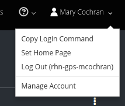
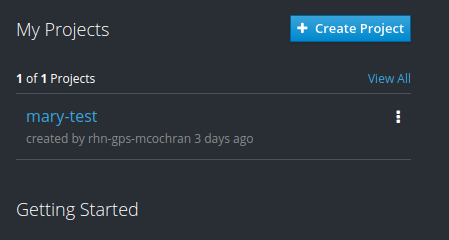

# Deploy Your Route to OpenShift

This lab assumes you have an OpenShift Online free account.  If you do not, please go to Step 00 here: https://github.com/mmistretta/RHSummit2018Camel3ScaleLab/tree/master/00-create-openshift-online-account

1. Go to https://manage.openshift.com/ and login using RH Developer Credentials


2. Click link to go to OpenShift Management Console


3. Click the drop down menu in the upper right hand corner with your name and select 'Copy Login Command'



4. Go to terminal window and paste the copied oc login command

```
[marycochran@localhost RHSummit2018Camel3ScaleLab]$ oc login https://api.starter-ca-central-1.openshift.com --token=<MYTOKEN>
Logged into "https://api.starter-ca-central-1.openshift.com:443" as "rhn-gps-mcochran" using the token provided.

You don't have any projects. You can try to create a new project, by running

    oc new-project <projectname>
```

5. Create a new project using `oc new-project <yourName>-RHSummit2018-project`

6. In your Camel project open the `pom.xml` in the base folder of the project

7.  Add this code to support the fabric8 Maven plugin. This allows you to deploy to your OpenShift project right from your command line as part of your Maven build process.

```xml
      <plugin>
        <groupId>io.fabric8</groupId>
        <artifactId>fabric8-maven-plugin</artifactId>
        <version>${fabric8.maven.plugin.version}</version>
        <executions>
          <execution>
            <goals>
              <goal>resource</goal>
              <goal>build</goal>
            </goals>
          </execution>
        </executions>
      </plugin>
```

8. Run ‘mvn fabric8:deploy’ from your Camel project directory
```
[INFO] F8: Pushed 18/26 layers, 69% complete
[INFO] F8: Pushed 19/26 layers, 73% complete
[INFO] F8: Pushed 20/26 layers, 77% complete
[INFO] F8: Pushed 21/26 layers, 81% complete
[INFO] F8: Pushed 22/26 layers, 85% complete
[INFO] F8: Pushed 23/26 layers, 89% complete
[INFO] F8: Pushed 24/26 layers, 93% complete
[INFO] F8: Pushed 25/26 layers, 96% complete
[INFO] Current reconnect backoff is 8000 milliseconds (T3)
[INFO] F8: Pushed 26/26 layers, 100% complete
[INFO] Current reconnect backoff is 16000 milliseconds (T4)
[INFO] F8: Push successful
[INFO] F8: Build summit-example-s2i-6 Complete
```

9. Select your project from your OpenShift web console



10. Copy the link in the top right hand corner of your application listing


11. Paste this route url + '/camel/hello' into a browser or curl request

```
curl http://summit-example-mary-test.193b.starter-ca-central-1.openshiftapps.com/camel/hello
```

12. You should see the same JSON response you did locally

```json
{"response":"Hello World","name":"your name"}
```
