# Manage Your API with 3Scale

## Connecting your Customers API to 3scale API Management

In order to connect your Customers API to 3scale, you need to follow three simple steps:

1. Access your 3scale Admin Portal and set up your first service.
2. Customize your Developer Portal and sign up as a developer.
3. Integrate your API with 3scale using the API gateway.

## Step 0: Review Pre-Reqs

Before provisioning an on-premise API gateway environment, you will want to check on the following regarding your 3scale SaaS account :

1. 3scale Domain
    * You should know what the domain name is of your 3scale SaaS accoount is.
    * The name of your 3scale domain is referenced in the URL to your Administrative Portal of the 3scale SaaS environment. ie: https://&lt;YOURDOMAIN&gt;-admin.3scale.net/p/admin/dashboard.

2. 3scale Access Token
    * To get an Access Token, you can easily create one by navigating to:
        `Gear Icon in top right corner -> Personal Settings -> Tokens -> Add Access Token`
         + The scope of your access token should be: *Account Management API*.
    * Also ensure that your access token has *Read Only* permissions.

> **Note:** Don't forget to copy your token into a safe place as this is the only point where you'll be able to view it. If you fail to do so, you can always create a new access token.

## Step 1: Define your API

Your 3scale Admin Portal (http://&lt;YOURDOMAIN&gt;-admin.3scale.net) provides access to a number of configuration features.

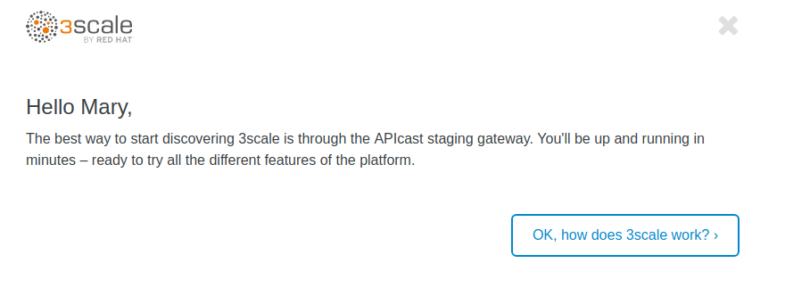

1. Login into the Admin Portal:

2. If it's the first time you access the 3scale portal, like when you click the *activate* link from the sign up email, dismiss and close the wizard by clicking on the top right **X**.


3. The first page you will land is the API tab. From here we will create our API definition. Click on the `Integration` link. Note: If you do not land on this page simply click API in the upper right hand corner. 


4. Click on the `edit integration settings` to edit the API settings for the gateway.


5. Select the **APIcast** (hosted) Gateway deployment option.

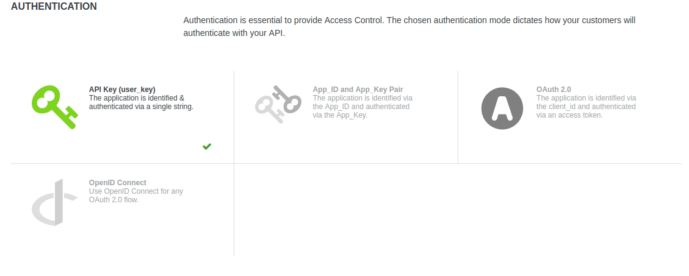

6. Keep the **API Key (user_key)** Authentication.

7. Click on **Update Service**


8. Click on the **add the Base URL of your API and save the configuration** button.  This is the url you can hit from your deployed Open Shift service.


9. Expand the **mapping rules** section to define the allowed methods on our exposed API. In our example this is `/camel/hello`
    > **Note:** the default mapping is the root ("/") of our API resources, something that we might want to avoid.

10. Click on the **Metric or Method (Define)**  link.


11. Click on the **New Method** link in the *Methods* section.


12. Fill in the information for your Fuse Method.

    **Friendly name:** `hello_World`
    **System name:** `hello_World`
    **Description:** `Method to say Hello World`

13. Click on **Create Method**


14. Click on the **Add mapping rule** link


15. Click on the edit icon next to the GET mapping rule.

16. Enter `/camel/hello` as the Pattern, or whatever pattern you chose when developing your Camel Route

18. Select `hello_World` as Method.


19. Scroll up and update the base url to the route url from Open Shift, similar to `http://summit-example-rh-summit-isaas.1d35.starter-us-east-1.openshiftapps.com`

19. Scroll down to the **API Test GET request**.


20. Enter `/camel/hello` or your pattern


21. Click on the **Update the Staging Environment** to save the changes and then click on the **Back to Integration & Configuration** link.


22. Click on the **Promote v.1 to Production** button to promote your configuration from staging to production.

23. Success! Your 3scale access control layer will now only allow authenticated calls through to your backend API.

24. Make sure to test your API using curl or a web browser.  It wil be something similar to:
```
curl "https://mary-test-summit-23981.staging.gw.apicast.io:443/camel/hello?user_key=910283921732184328643276dz9asd9324"
``` 

## Step 2: Play with your API and 3Scale

### Add Rate Limits to Your API


1. From your 3Scale admin homepage click 'Definition'. 


2. From the side bar select 'Application Plans'

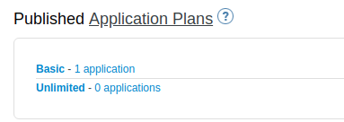

3. Click on Basic

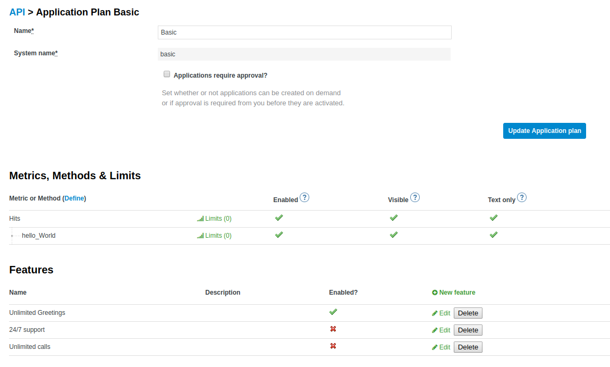


4. Click on Limits next to your method ('hello_World' or other)

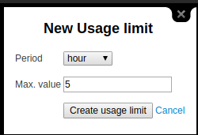

5. Add new Usage Limit

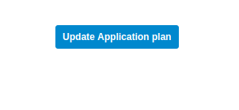

6. Select 'Update Application Plan'

### Setup Alerts

1. From your 3Scale homepage select 'Definition' just like you did above. 

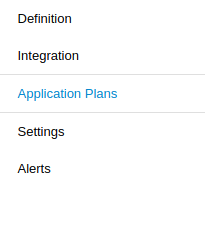

2. Select 'Alerts' from the side menu


3. Select whatever checkboxes you would like to see for 'Alerts'.  Then hit your API as many times as needed to hit the alert.  

### View Analytics


1. From any page in your 3Scale admin portal select 'Analytics' from the top bar.  Then browse the analytis as you desire. 

### Register a new Developer in the Developer Portal

The focal point of your developers’ experience is the API developer portal, and the level of effort you put into it will determine the level of decreased support costs and increased developer engagement. 3scale provides a built-in, state-of-the-art CMS portal, making it very easy to create your own branded hub with a custom domain to manage developer interactions and increase API adoption.

You can customize the look and feel of the entire Developer Portal to match your own branding. You have complete control over every element of the portal, so you can make it as easy as possible for developers to learn how to use your API.

The Developer Portal's CMS consists of a few elements:
* Horizontal menu in the Admin Portal with access to content, redirects, and changes
* The main area containing details of the sections above
* CMS mode, accessible through the preview option

Liquid is a simple programming language used for displaying and processing most of the data from the 3scale system available for API providers. In the 3scale platform, it is used to expose server-side data to your API developers, greatly extending the usefulness of the CMS while maintaining a high level of security.


1. Click on the `Developer Portal` tab to access the developer portal settings.

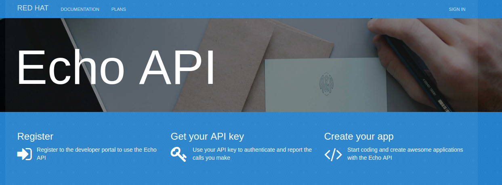

2. Click on the `Visit Developer Portal` to take a look of how your developer portal looks like.

You can see there is a default portal with information of your API and how to signup. Unfortunately the API information is incorrect.
    > **Note:** We will edit our portal to update it with the correct information 

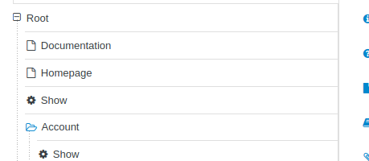

4. Go back to browse the top of the content sub-sections and find the `Homepage` section.

5. Change all the code `Echo` references in the homepage code for `Hello World`.

6. Update the API call examples to reflect your real Fuse API calls.
    > **Note:** Use your production base url and add your defined methods. Dont worry if you don't have the "real" output, it won't affect the rest of the lab.

7. Refresh your Developer Portal's browser tab to check the changes.

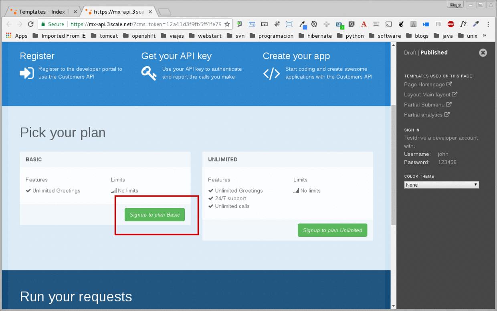

8. Take the place of one of your developers and signup for the **Basic** plan.


9. Fill in your information and your email to register as a developer. Click on the `Sign up` button.
    > **Note:** Use an email address you can actually access.

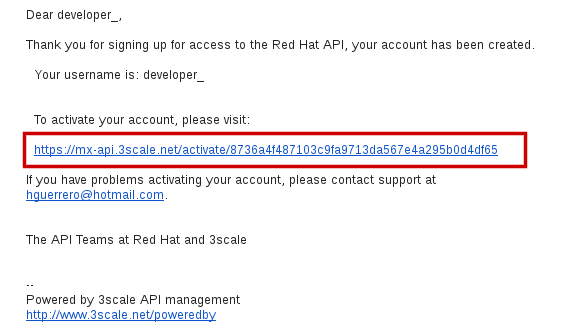

10. Check your email and click on the `activate` link.


11. As your portal is not currently public, you will need your portal code to finish the registration. You can get the code in your admin portal navigating to: `Settings > Developer Portal > Domains & Access`.

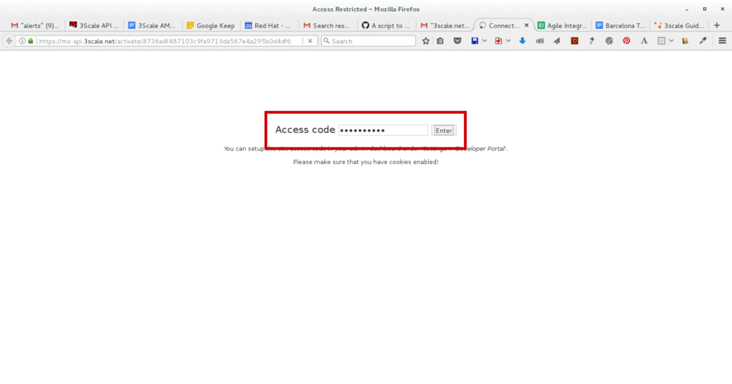

12. Type your portal code to finish the account activation.

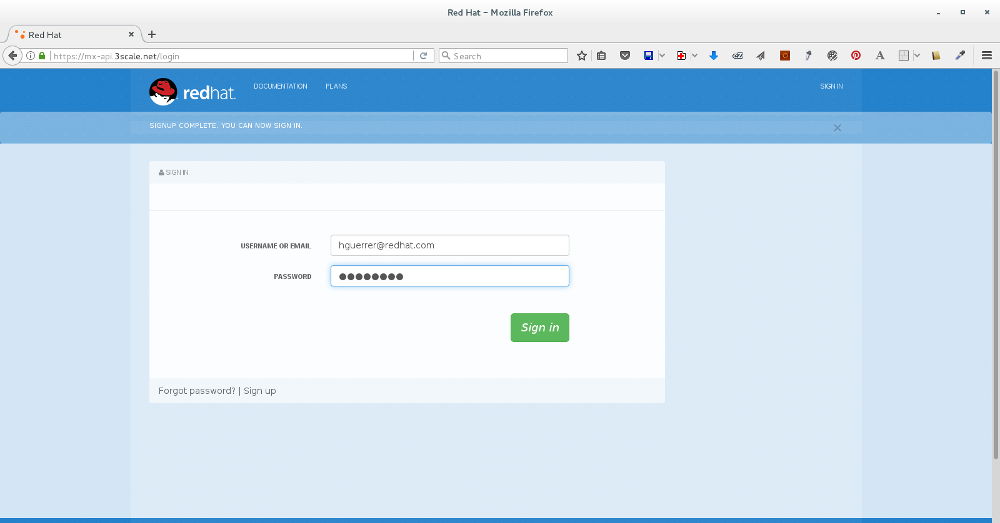

13. Now that your developer account is active, sign in the portal.


14. You will land in the developers homepage, where you will be able to check your developers settings and retrieve your `User Key`.
    > **Note:** Copy down this key as it is used to authenticate yourself to the managed API.
    
15. Now you can make test requests to your API using this api key
